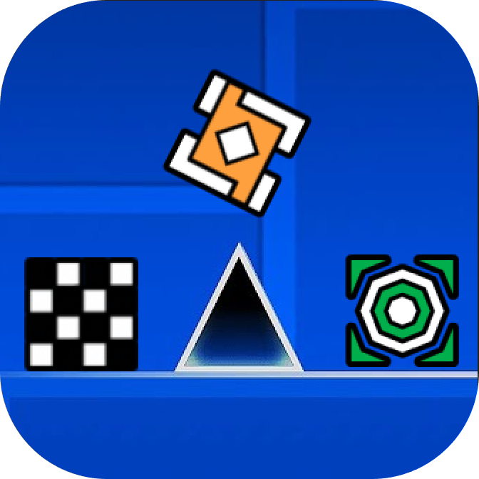

# Icon Changer

Allows you to change your icons and colors while playing a level by adding a button to the pause menu to do so. For people that definetly can't decide what to use and/or are very impatient.
